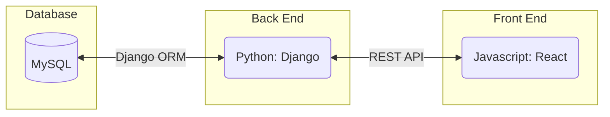
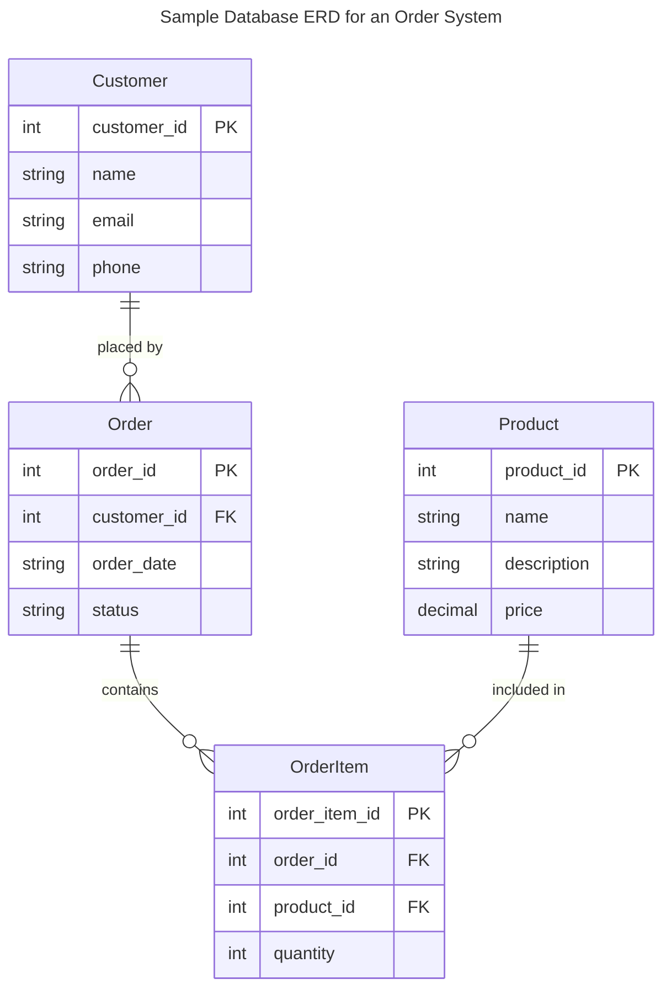
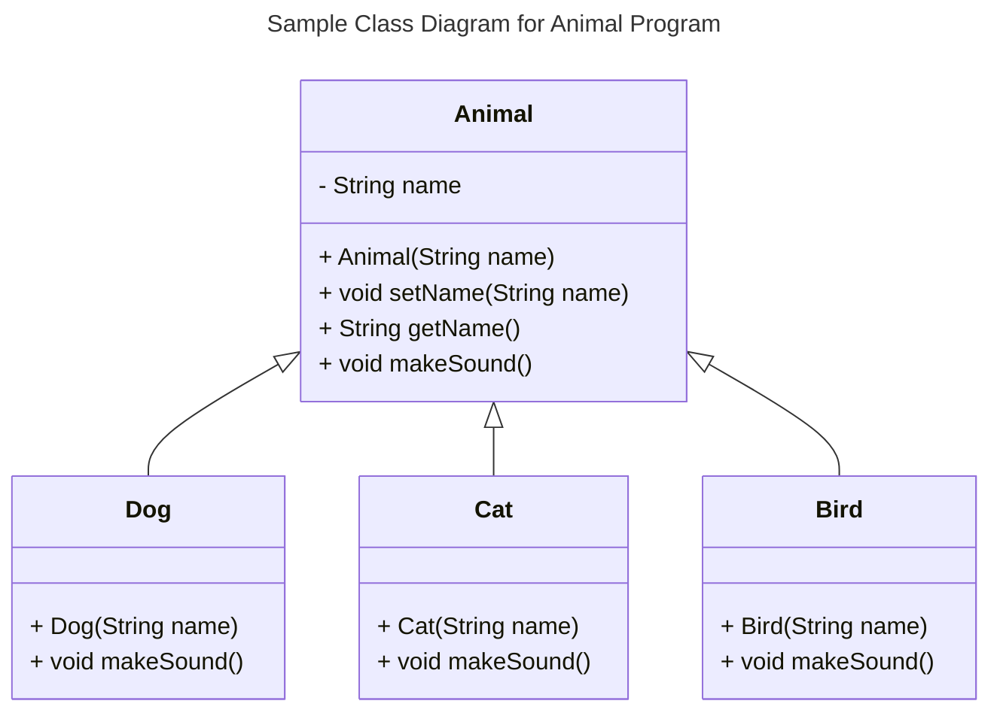
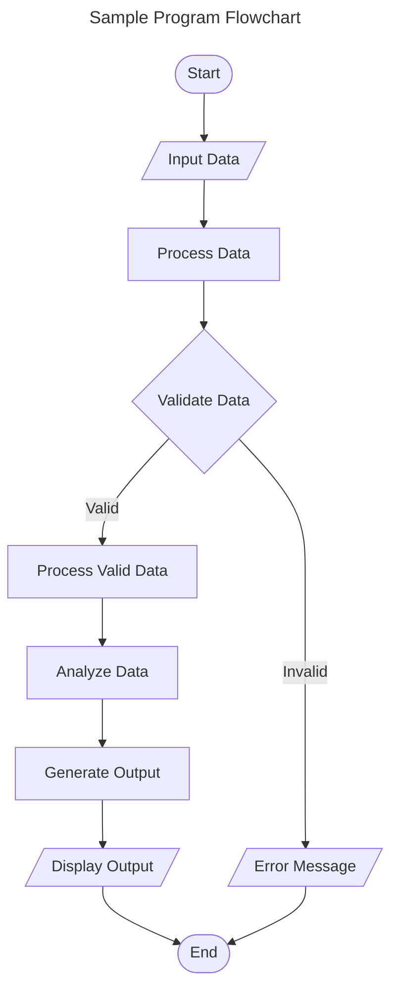
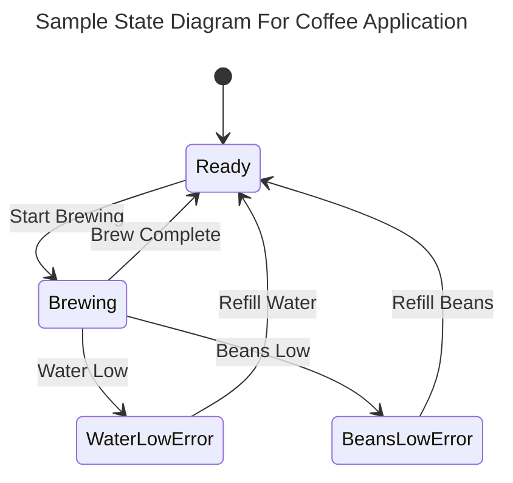
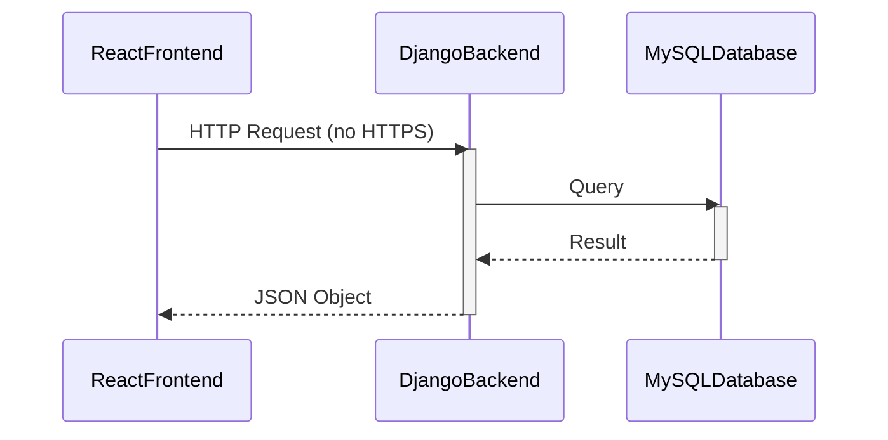

# Requirements and Specification Document

## TeamName

<!--The name of your team.-->

## *Python Airways*

***


### Project Abstract

<!--A one paragraph summary of what the software will do.-->

This document outlines the requirements and specifications for Python Airways. This is a comprehensive web application that is designed for the aviation industry to track and manage their aircract inventory across different airports. This inventory management system is designed to offer real-time visibility into the status as well as the location of an aircraft, ensuring that businesses have accurate records of all aircrafts at all times. 

### Customer

### Scrum Masters and Product Owners for All Sprints

| Sprint #    |    Scrum Masters    |    Product Owners |
| ------ | :-------: | ------: |
| 0/1 |    @figenblat    | @kgautam3 |
| 2    | @qxu229 |  @CCHENG93    |
| 3| @sbyun9 |@nbaumeister|

<!--A brief description of the customer for this software, both in general (the population who might eventually use such a system) and specifically for this document (the customer(s) who informed this document). Every project will have a customer from the CS506 instructional staff. Requirements should not be derived simply from discussion among team members. Ideally your customer should not only talk to you about requirements but also be excited later in the semester to use the system.-->

### User Requirements

<!--This section lists the behavior that the users see. This information needs to be presented in a logical, organized fashion. It is most helpful if this section is organized in outline form: a bullet list of major topics (e.g., one for each kind of user, or each major piece of system functionality) each with some number of subtopics.-->

The following user requirements reflect the unique aspects of Python Airways' operation. They focus on secure access, location-specific data interaction, mandatory reporting for operational consistency, view-only access for higher-level management, and the procedurues of scheduling aircraft movements. These requirements ensure the system supports efficient, secure, and user-friendly management of aircraft across Python Airways' network.

| ID   | Description                                                  | Priority | Status |
| ---- | ------------------------------------------------------------ | -------- | ------ |
| R11  | When the user first opens the web page, the frontend SHALL prompt the user to login. Upon logging in, the backend SHALL authenticate users by validating their existing company credentials against the company's user database. | Med      | Open   |
| R12 | Successful authentication should grant access to the application, ensuring secure user access. If authentication fails due to incorrect company credentials entered by the user, the frontend should display an error message and do not grant access to the application. | Med | Open |
| R13  | After clicking airports on the map, the front SHALL request data from backend and display the corresponding information. The backend SHALL access the database and return the results back to frontend. | High     | Currently working   |
| R14 | The system provides a functionality that allows users to select a specific date and time range. Upon selection, the frontend SHALL display a list of all scheduled aircraft arrivals and departures within the chosen timeframe. This list includes details such as flight number, aircraft type, estimated time of arrival or departure and deprature or arrival airports | High |Currently working |
| R15 | The system provides an interactive map interface allowing authorized user roles to create a new airport after selecting a location on the map with a mouse click. Upon mouse click, the system SHALL prompt the user to enter required information for adding a new airport, including airport name, airport code, and geographical coordinates. The backend SHALL validate the entered information for completeness and uniqueness against the existing airport database. If validation succeeds, the system SHALL add the new airport to the database and visually indicate the addition on the interactive map. If validation fails, the system SHALL display an error message detailing the reason for failure.| High | Currently working|
| R16  | The system provides an interface to schedule future aircraft arrivals and departures. This interface SHALL allow airport managers to specify the date, time, airline, flight number, and aircraft type for each arrival or departure. Upon submission of a new schedule, the backend SHALL validate the entry for conflicts with existing schedules. If the new schedule passes validation, the system SHALL record it in the movements database. If the validation fails, the system SHALL display an informative error message. | High     | Open   |

<!-- <div align="center"><small><i>Excerpt from Crookshanks Table 2-2 showing example user requirements for a timekeeping system</i></small></div> -->


## Use Cases & User Stories

### Corporate Manager User Stories for Python Airways:

As a corporate manager, I want to see a count of how many airports are under Python Airways' operation.

    -This allows a high-level overview of the operational scale.

As a corporate manager, I want to view an aggregate of aircraft movements (arrivals and departures) across all airports over a specified time span.

    -To monitor overall traffic flow and operational activity.

As a corporate manager, I want to initiate the opening of a new airport within the Python Airways network.

    -For expanding operational reach and capacity.

As a corporate manager, I want to mark an airport as no longer in operation from a specific date, ensuring it's excluded from future aggregates.

    -To keep data relevant and accurate after operational changes.

As a corporate manager, I want to see all Python Airways' airports represented on a map.

    -For a geographical overview of operations.

### Facility (Airport) Manager User Stories for Python Airways:

As an airport manager, I want to view the current aircraft inventory at my airport.

    -Enables real-time monitoring of aircraft presence.

As an airport manager, I want to view historical and future aircraft inventory at my airport.

    -To plan for capacity and maintenance scheduling.

As an airport manager, I want to record an aircraft's arrival or departure, including the specific aircraft details, and have this automatically update our inventory.

    -For maintaining accurate, real-time inventory records.

As an airport manager, I want to schedule future aircraft arrivals or departures.

    -To efficiently manage airport traffic and allocations.

As an airport manager, I want to see a list of arrivals/departures that included a specific type of aircraft.

    -For tracking usage and movements of particular aircraft models or types.


1. You
   1. Can
      1. Also
2. Use
   1. Numbered
      1. Lists

### User Interface Requirements

<!--Describes any customer user interface requirements including graphical user interface requirements as well as data exchange format requirements. This also should include necessary reporting and other forms of human readable input and output. This should focus on how the feature or product and user interact to create the desired workflow. Describing your intended interface as “easy” or “intuitive” will get you nowhere unless it is accompanied by details.-->

<!--NOTE: Please include illustrations or screenshots of what your user interface would look like -- even if they’re rough -- and interleave it with your description.-->

Images can be included with ``

The following UI requirements are designed to ensure that the inventory management system is not only functional but also user-friendly, accommodating the specific needs of corporate and airport managers within Python Airways. By focusing on responsiveness, ease of use, accessibility, and security, the system can provide a seamless experience for all users.

| Requirement ID | Description                                                                                                                                                 |
|----------------|-------------------------------------------------------------------------------------------------------------------------------------------------------------|
| UI01           | The interface should be responsive, adapting seamlessly to desktop, tablet, and mobile devices to ensure accessibility across different platforms.          |
| UI02           | Implement a dashboard view for corporate managers featuring summary statistics, aggregate inventory movements, and map visualizations of airports.          |
| UI03           | Airport managers should have a clear, intuitive interface for viewing current and historical aircraft inventory, as well as scheduling and recording shipments. |
| UI04           | Use a consistent, aviation-themed color scheme and typography throughout the application to reinforce branding and improve visual cohesion.                |
| UI05           | Navigation menus should be clearly labeled and logically organized to facilitate easy access to different sections of the application.                     |
| UI06           | Forms for entering or updating aircraft information and scheduling shipments should include validation feedback to prevent user errors.                     |
| UI07           | Implement modals for confirming actions (e.g., adding a new airport, marking an airport as ceased operation) to prevent accidental data changes.            |
| UI08           | Provide a search function with filtering capabilities to quickly locate specific aircraft, airports, or shipments within the system.                       |
| UI09           | Include interactive tooltips and help icons throughout the application to offer users guidance and explanations for various features and data fields.      |
| UI10           | Implement a secure login page with clear input fields for username and password, including the option for password visibility toggle and forgot password link. |
| UI11           | The UI should provide real-time feedback to users after actions are taken, such as successful data submission or error messages.                          |
| UI12           | Integrate a comprehensive reporting section where users can generate, view, and export reports based on various criteria (time periods, airports, etc.).    |


### Security Requirements

<!--Discuss what security requirements are necessary and why. Are there privacy or confidentiality issues? Is your system vulnerable to denial-of-service attacks?-->

### System Requirements

<!--List here all of the external entities, other than users, on which your system will depend. For example, if your system inter-operates with sendmail, or if you will depend on Apache for the web server, or if you must target both Unix and Windows, list those requirements here. List also memory requirements, performance/speed requirements, data capacity requirements, if applicable.-->

| Requirement Category | Requirement Description                                                                                                                                                                                                                   |
|----------------------|-------------------------------------------------------------------------------------------------------------------------------------------------------------------------------------------------------------------------------------------|
| **Database: MySQL**  | - Support for complex queries for aircraft and user information. <br> - Optimized schema for efficient data storage and retrieval.                                                                                                        |
| **Back End: Django (Python)** | - Utilize Django’s ORM for database interactions. <br> - Implement RESTful APIs for frontend-backend communication. <br> - Adhere to security practices for authentication and data protection.                                          |
| **Front End: React** | - Develop a responsive UI with React for enhanced user experience. <br> - Implement dynamic updates using React's state management.                                                                                                       |
| **External Dependencies** | - Compatibility with WSGI (Web Server Gateway Interface is a specification that describes how a web server communicates with web applications, and how web applications can be chained together to process one request. WSGI is a Python standard.) servers like Gunicorn or uWSGI. <br> - Deployable on cloud platforms (AWS, GCP, Azure) supporting the tech stack.                                                                                                |
| **System Architecture** | - Seamless communication through REST APIs and Django ORM.                                                                                      |

### Specification

<!--A detailed specification of the system. UML, or other diagrams, such as finite automata, or other appropriate specification formalisms, are encouraged over natural language.-->

<!--Include sections, for example, illustrating the database architecture (with, for example, an ERD).-->

<!--Included below are some sample diagrams, including some example tech stack diagrams.-->

You can make headings at different levels by writing `# Heading` with the number of `#` corresponding to the heading level (e.g. `## h2`).

#### Initial Roles
| DjangoBackend    |    ReactFrontend    |    Database |
| ------ | :-------: | ------: |
| @CCHENG93 |    @sbyun9    | @nbaumeister |
| @qxu229    | @figenblat |         |
|@kgautam3||

#### Technology Stack

The Technology Stack of a web app contains three parts: **Front end**, **Back end** and **Database** (in order from user to server.)

- **Database:** in our project, database will be used to store information of aircrafts and users (including username and hashed password,) Since MySQL is a requirement for this class, we will use **MySQL.**

- **Back end:** multiple back-end frameworks are available for modern web apps. We will use **Django** in **Python** for our back-end implementation.

- **Front end:** modern front-end frameworks includes React and Vue.js. We will use **React** library for our front-end implementation.

#### System Architecture Diagram




#### Database



#### Class Diagram



#### Flowchart



#### Behavior



#### Sequence Diagram

The sequence diagram is inherited from the system tech stack. For front-end and back-end, we follow the normal sequence of REST. For back-end and database, as we mentioned, Django ORM (a standard module of Django perform general SQL querying commands) is utilized to communicate with the database.



### Standards & Conventions

<!--Here you can document your coding standards and conventions. This includes decisions about naming, style guides, etc.-->

#### 1. Introduction

This document outlines the coding standards and best practices for T27. Its goal is to ensure that our codebase is consistent, readable, and maintainable by all team members and future contributors. Adherence to these guidelines is crucial for effective collaboration and the long-term success of the project.

#### 2. Coding Style Guidelines

##### Indentation

- Use `tabs`, not white spaces, with a standard indent size of 4 spaces.

- Each nested block should be properly indented and spaced.

##### Line Length

- Aim for a maximum line length of 80 characters where possible for better readability across various environments.

##### Whitespace

- Use blank lines sparingly to separate logical blocks of code.

##### Braces

- Use the `one true brace style` variant of the K&R style for braces except for python. Consider the example below from [indentation style wikipedia](https://en.wikipedia.org/wiki/Indentation_style).
```
while (x == y) {
    foo();
    bar();
}
```

#### 3. Naming Conventions

##### Variables

- Use `camelCase` or `lower camel case` for variable names and be descriptive.

##### Functions/Methods

- Use `camelCase` or `lower camel case` for functions/methods and start with a verb to indicate action.

##### Classes/Interfaces

- Use `PascalCase` or `upper camel case` for classes and interfaces.

##### Constants

- Use `UPPER_SNAKE_CASE` for constants.

##### Global Variables

- Avoid using global variables in all contexts.

#### 4. File Organization

##### Directory Structure

- Organize the project into logical directories, with separate folders for source code, tests, documentation, and assets.

##### File Naming

- Name files consistently, using a convention that reflects the file's purpose or the type of content it holds.

##### Module Organization

- Group related functions, classes, and variables together within modules or files.

#### 5. Commenting and Documentation

##### Inline Comments

- Use inline comments sparingly to explain "why" rather than "what" the code does.

##### Block Comments

- Use block comments for more detailed explanations or to mark off sections of code.

##### Documentation Comments

- Use documentation comments to automatically generate API documentation.
- See [javadoc wikipedia](https://en.wikipedia.org/wiki/Javadoc) for more information.

##### READMEs and Other Docs

- Maintain a comprehensive README file at the root of the project, along with any other necessary documentation (installation guides, usage examples, etc.).

#### 6. Version Control Practices

##### Branching Model

- Follow a standardized branching model (e.g., Git Flow or GitHub Flow) for development, features, releases, and hotfixes.

##### Commit Messages

- Write clear, concise commit messages that explain the changes made and the reason for them.

##### Pull Requests and Code Reviews

- Use pull requests for merging code into the main branch and conduct code reviews to maintain quality.

#### 7. Performance Considerations

##### Efficient Algorithms

- Choose or implement algorithms that are efficient in terms of time and space complexity.

##### Memory Management

- Be mindful of memory allocation and deallocation, especially in languages where manual memory management is necessary.

#### 8. Tooling and Environment

##### IDEs/Editors

- Recommend specific IDEs/editors that are well-suited for the project, along with plugins or extensions that enforce the coding standards.

##### Build Tools

- Specify the build tools and scripts used in the project to ensure consistency in builds.

##### Dependency Management

- Use a dependency management tool to manage libraries and frameworks the project depends on, ensuring that everyone uses the same version.

### 9. Unit Testing

#### Frontend

#### Backend

### 10. CI/CD
