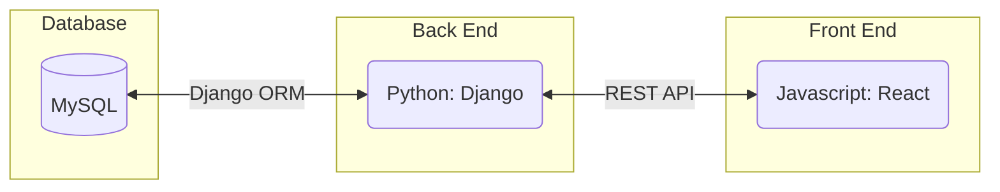
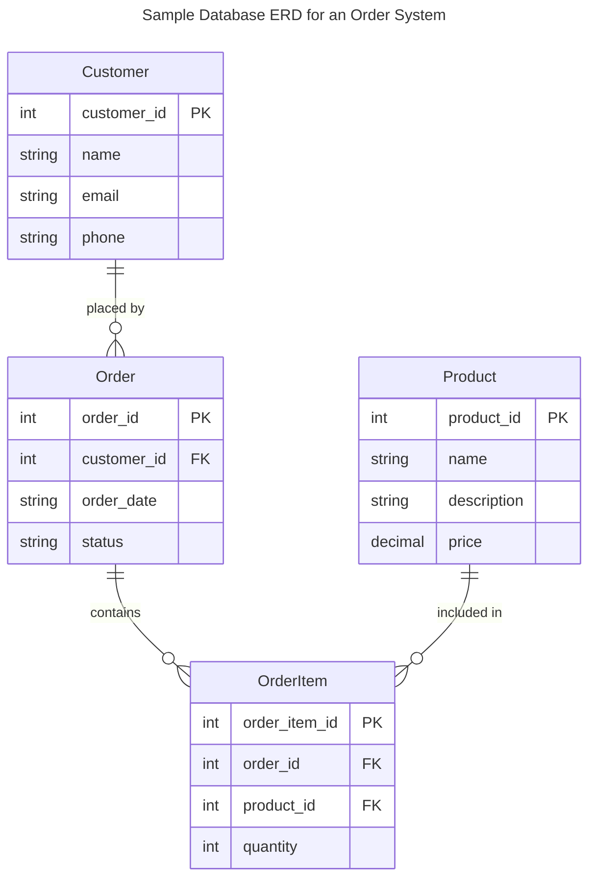
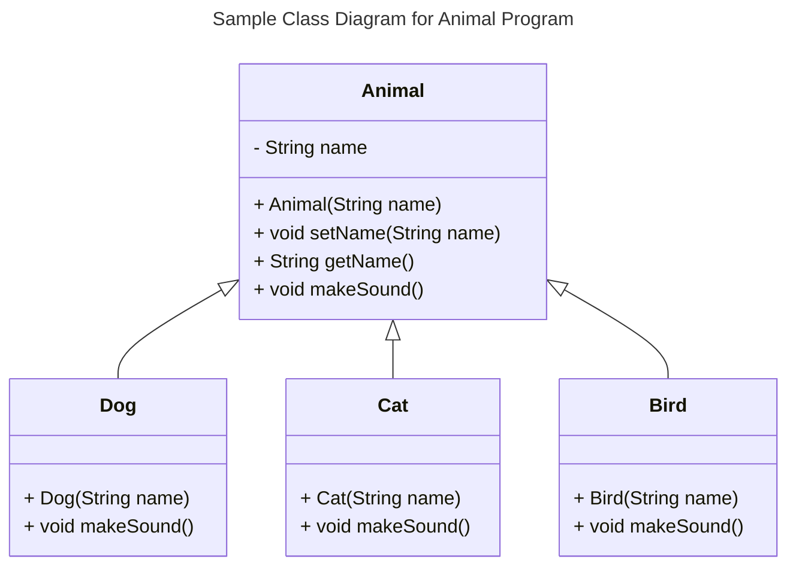
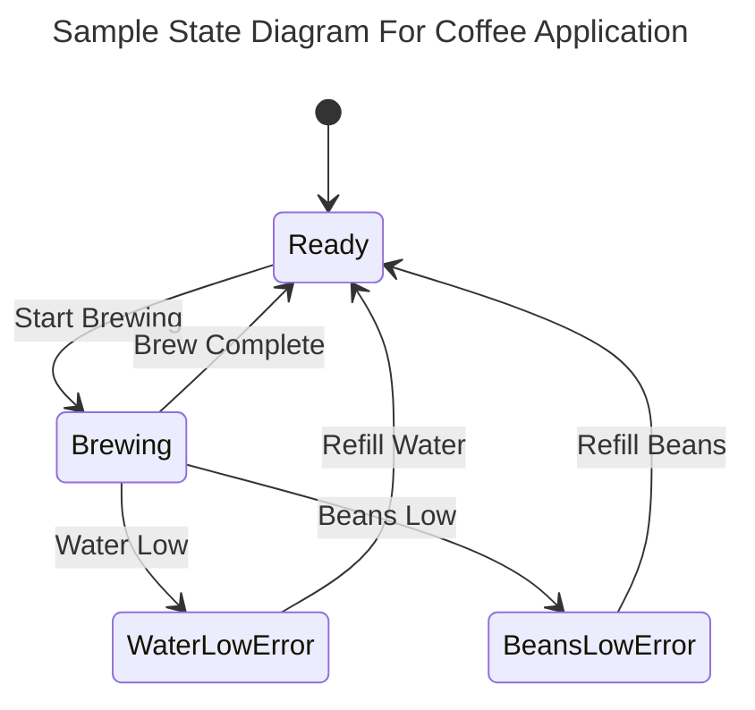
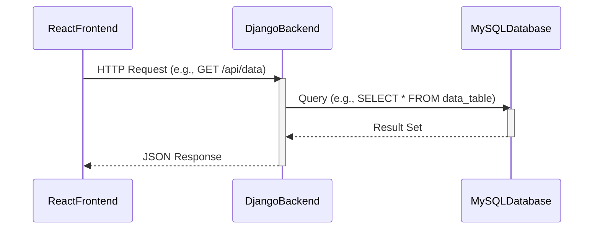

# Requirements and Specification Document

## TeamName

<!--The name of your team.-->

 ### *Python Airways*
***


### Project Abstract

<!--A one paragraph summary of what the software will do.-->

This document outlines the requirements and specifications for Python Airways. This is a comprehensive web application that is designed for the aviation industry to track and manage their aircract inventory across different airports. This inventory management system is designed to offer real-time visibility into the status as well as the location of an aircraft, ensuring that businesses have accurate records of all aircrafts at all times. 

### Customer

<!--A brief description of the customer for this software, both in general (the population who might eventually use such a system) and specifically for this document (the customer(s) who informed this document). Every project will have a customer from the CS506 instructional staff. Requirements should not be derived simply from discussion among team members. Ideally your customer should not only talk to you about requirements but also be excited later in the semester to use the system.-->

### User Requirements

<!--This section lists the behavior that the users see. This information needs to be presented in a logical, organized fashion. It is most helpful if this section is organized in outline form: a bullet list of major topics (e.g., one for each kind of user, or each major piece of system functionality) each with some number of subtopics.-->

Here is a user requirements sample from [Crookshanks](https://learning-oreilly-com.ezproxy.library.wisc.edu/library/view/practical-software-development/9781484206201/9781484206218_Ch02.xhtml):

| ID   | Description                                                  | Priority | Status |
| ---- | ------------------------------------------------------------ | -------- | ------ |
| R11  | Users should not have to sign into the system; their current network login should be used for identification. | Med      | Done   |
| R12  | The user should pick a project first; the tasks available are a derivative of the project. | High     | Open   |
| R13  | A full-time employee should not be able to submit a time card with less than 40 hours per week recorded. | High     | Open   |
| R14  | A contractor can submit any number of hours up to 60 without special approval. | Med      | Open   |
| R15  | A team lead can see his/her team's time cards before they are submitted but cannot approve them until the user submits it. | High     | Open   |

<div align="center"><small><i>Excerpt from Crookshanks Table 2-2 showing example user requirements for a timekeeping system</i></small></div>

- You 
  - Can
    - Use
- Bullet
  - Points
    - In
    - Markdown

### Use Cases & User Stories

<!--Use cases and user stories that support the user requirements in the previous section. The use cases should be based off user stories. Every major scenario should be represented by a use case, and every use case should say something not already illustrated by the other use cases. Diagrams (such as sequence charts) are encouraged. Ask the customer what are the most important use cases to implement by the deadline. You can have a total ordering, or mark use cases with “must have,” “useful,” or “optional.” For each use case you may list one or more concrete acceptance tests (concrete scenarios that the customer will try to see if the use case is implemented).-->

Here is a sample user story from [Clean Agile](https://learning-oreilly-com.ezproxy.library.wisc.edu/library/view/clean-agile-back/9780135782002/ch03.xhtml#ch03lev1sec1) using a markdown block quote:

> As the driver of a car, in order to increase my velocity, I will press my foot harder on the accelerator pedal.

1. You
   1. Can
      1. Also
2. Use
   1. Numbered
      1. Lists

### User Interface Requirements

<!--Describes any customer user interface requirements including graphical user interface requirements as well as data exchange format requirements. This also should include necessary reporting and other forms of human readable input and output. This should focus on how the feature or product and user interact to create the desired workflow. Describing your intended interface as “easy” or “intuitive” will get you nowhere unless it is accompanied by details.-->

<!--NOTE: Please include illustrations or screenshots of what your user interface would look like -- even if they’re rough -- and interleave it with your description.-->

Images can be included with ``

### Security Requirements

<!--Discuss what security requirements are necessary and why. Are there privacy or confidentiality issues? Is your system vulnerable to denial-of-service attacks?-->

### System Requirements

<!--List here all of the external entities, other than users, on which your system will depend. For example, if your system inter-operates with sendmail, or if you will depend on Apache for the web server, or if you must target both Unix and Windows, list those requirements here. List also memory requirements, performance/speed requirements, data capacity requirements, if applicable.-->

| You    |    can    |    also |
| ------ | :-------: | ------: |
| change |    how    | columns |
| are    | justified |         |

### Specification

<!--A detailed specification of the system. UML, or other diagrams, such as finite automata, or other appropriate specification formalisms, are encouraged over natural language.-->

<!--Include sections, for example, illustrating the database architecture (with, for example, an ERD).-->

<!--Included below are some sample diagrams, including some example tech stack diagrams.-->

You can make headings at different levels by writing `# Heading` with the number of `#` corresponding to the heading level (e.g. `## h2`).

#### Technology Stack

The Technology Stack of a web app contains three parts: **Front-end**, **Back-end** and **Database** (in order from user to server.)

- **Database:** in our project, database will be used to store information of aircrafts and users (including username and hashed password,) Since MySQL is a requirement for this class, we will use **MySQL.**

- **Back-end:** multiple back-end frameworks are available for modern web apps. We will use **Django** in **Python** for our back-end implementation.

- **Front-end:** modern front-end frameworks includes React and Vue.js. We will use **React** library for our front-end implementation.

#### System Architecture Diagram




#### Database



#### Class Diagram



#### Flowchart


#### Behavior



#### Sequence Diagram



### Standards & Conventions

<!--Here you can document your coding standards and conventions. This includes decisions about naming, style guides, etc.-->

#### 1. Introduction

This document outlines the coding standards and best practices for T27. Its goal is to ensure that our codebase is consistent, readable, and maintainable by all team members and future contributors. Adherence to these guidelines is crucial for effective collaboration and the long-term success of the project.

#### 2. Coding Style Guidelines

##### Indentation

- Use `tabs`, not white spaces, with a standard indent size of 4 spaces.

- Each nested block should be properly indented and spaced.

##### Line Length

- Aim for a maximum line length of 80 characters where possible for better readability across various environments.

##### Whitespace

- Use blank lines sparingly to separate logical blocks of code.

##### Braces

- Use the `one true brace style` variant of the K&R style for braces except for python. Consider the example below from [indentation style wikipedia](https://en.wikipedia.org/wiki/Indentation_style).
```
while (x == y) {
    foo();
    bar();
}
```

#### 3. Naming Conventions

##### Variables

- Use `camelCase` or `lower camel case` for variable names and be descriptive.

##### Functions/Methods

- Use `camelCase` or `lower camel case` for functions/methods and start with a verb to indicate action.

##### Classes/Interfaces

- Use `PascalCase` or `upper camel case` for classes and interfaces.

##### Constants

- Use `UPPER_SNAKE_CASE` for constants.

##### Global Variables

- Avoid using global variables in all contexts.

#### 4. File Organization

##### Directory Structure

- Organize the project into logical directories, with separate folders for source code, tests, documentation, and assets.

##### File Naming

- Name files consistently, using a convention that reflects the file's purpose or the type of content it holds.

##### Module Organization

- Group related functions, classes, and variables together within modules or files.

#### 5. Commenting and Documentation

##### Inline Comments

- Use inline comments sparingly to explain "why" rather than "what" the code does.

##### Block Comments

- Use block comments for more detailed explanations or to mark off sections of code.

##### Documentation Comments

- Use documentation comments to automatically generate API documentation.
- See [javadoc wikipedia](https://en.wikipedia.org/wiki/Javadoc) for more information.

##### READMEs and Other Docs

- Maintain a comprehensive README file at the root of the project, along with any other necessary documentation (installation guides, usage examples, etc.).

#### 6. Version Control Practices

##### Branching Model

- Follow a standardized branching model (e.g., Git Flow or GitHub Flow) for development, features, releases, and hotfixes.

##### Commit Messages

- Write clear, concise commit messages that explain the changes made and the reason for them.

##### Pull Requests and Code Reviews

- Use pull requests for merging code into the main branch and conduct code reviews to maintain quality.

#### 7. Performance Considerations

##### Efficient Algorithms

- Choose or implement algorithms that are efficient in terms of time and space complexity.

##### Memory Management

- Be mindful of memory allocation and deallocation, especially in languages where manual memory management is necessary.

#### 8. Tooling and Environment

##### IDEs/Editors

- Recommend specific IDEs/editors that are well-suited for the project, along with plugins or extensions that enforce the coding standards.

##### Build Tools

- Specify the build tools and scripts used in the project to ensure consistency in builds.

##### Dependency Management

- Use a dependency management tool to manage libraries and frameworks the project depends on, ensuring that everyone uses the same version.
